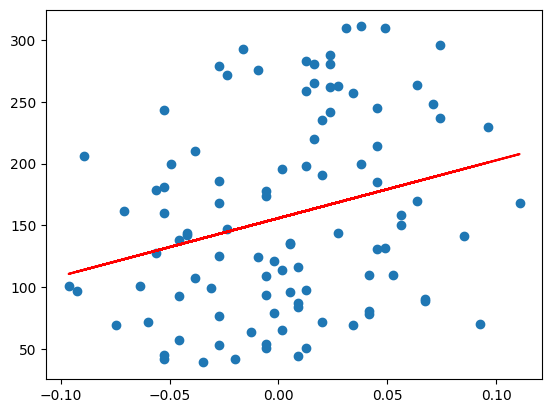

Let's create a tool which performs linear regression on numeric data retrieved from a Weaviate collection. For this example, we will use the default branch initialisation for the decision tree (`"one_branch"`), which includes tools for querying and retrieving data from a Weaviate collection. We are going to add a `fit_linear_regression` tool that extracts data from the environment, fits a linear regression model using [scikit-learn's linear regression](https://scikit-learn.org/stable/modules/generated/sklearn.linear_model.LinearRegression.html), plots and returns the results.

This example requires installing scikit learn as follows (with `pip`):
```bash
pip install -U scikit-learn
```


## Setup

### Configuring Elysia

You can set model API keys (e.g. `OPENAI_API_KEY` or `OPENROUTER_API_KEY`) and Weaviate API keys (i.e. `WEAVIATE_API_KEY`, `WEAVIATE_URL`) in your local `.env` file, or configure Elysia in python via:

```python
configure(
    base_model="gemini-2.0-flash-001",  # replace models and providers with which ever LM you want to use
    complex_model="gemini-2.0-flash-001",
    base_provider="openrouter/google",
    complex_provider="openrouter/google",
    wcd_url="...",  # replace with your Weaviate REST endpoint URL
    wcd_api_key="...",  # replace with your Weaviate cloud API key
    openrouter_api_key="...",  # replace with whichever API key you will use for your LMs
)
```

This handles which models you will use for preprocessing and decision tree evaluations, as well as sets any API keys if not in your local `.env` file.

### Downloading and Processing Data

We will use an example diabetes dataset provided by scikit learn for this example, loaded in python via:

```python
from sklearn import datasets

data = datasets.load_diabetes()
X, Y = data.data, data.target
```

And then import to Weaviate as follows:

```python
from elysia.util.client import ClientManager
import weaviate.classes.config as wvc

with ClientManager().connect_to_client() as client:
    collection = client.collections.create(
        "Diabetes", vector_config=wvc.Configure.Vectors.self_provided()
    )

    with collection.batch.dynamic() as batch:
        for i in range(len(X)):
            batch.add_object({"predictor": X[i, 0], "target": Y[i]})
```

Then this collection requires [preprocessing](../setting_up.md#preprocessing-collections) with Elysia:

```python
from elysia import preprocess
preprocess("Diabetes")
```

## Tool Construction

We will follow the [follow the basic guideline for creating a tool](../creating_tools.md). The general outline for this tool is going to be as follows:

- No LLM calls within the tool, the decision agent is going to be deciding inputs for the regression.
- The call of the tool is going to use the `LinearRegression` class from `sklearn` to fit the model.
- The tool is going to add to the environment the labelled coefficients from the regression.

To create a tool in Elysia, you can just write a python function and add the `@tool` decorator.

```python
from elysia import tool
from sklearn.linear_model import LinearRegression
import matplotlib.pyplot as plt

@tool
async def fit_linear_regression(env_key, x_var, y_var, collection_name, tree_data):
    """
    Fit a linear regression model to data. 
    Requires querying for data first.
    
    Args:
        env_key: The key of the environment to use (e.g. 'query').
        x_var: Independent variable field name in environment under the key.
        y_var: Dependent variable field name in environment under the key.
    """
    objs = tree_data.environment.find(env_key, collection_name, 0)["objects"]
    X = [[datum.get(x_var)] for datum in objs]
    Y = [datum.get(y_var) for datum in objs]

    model = LinearRegression().fit(X, Y)

    plt.scatter(X, Y)
    plt.plot(X, model.predict(X), color="red")
    plt.show()

    return {
        "intercept": model.intercept_,
        "coef": model.coef_,
        "collection_name": collection_name
    }
```

- The tool description is taken from the docstring of the function.
- In this case, the inputs themselves do not receive individual descriptions, but they are provided via the tool description.
- The `env_key`, `x_var`, `y_var` and `collection_name` arguments are specific to this tool (so they are decided by the decision agent). But the `tree_data` argument is a protected argument which will use the data in the decision tree, which is how Elysia interacts with its context and environment.
- The returned dictionary adds the items returned will be added to Elysia's environment, so the decision tree can read this information on a future run.

## Running the Tool

Let's initialise a tree, add the tool and test it runs correctly. 

```python
from elysia import Tree
tree = Tree()
tree.add_tool(fit_linear_regression)
response, objects = tree(
    "Fit a linear regression on the Diabetes data",
    collection_names = ["Diabetes"]
)
```
And some relevant output from the run:
```
DEBUG    Tasks completed (iteration 1):
            - query (Avg. 6.67 seconds)                                                         
            - query_postprocessing (Avg. 0.00 seconds)                                          
                                                                                                
DEBUG    Tasks completed (iteration 2):
            - fit_linear_regression (Avg. 0.04 seconds)                                         
                                                                                                
DEBUG    Tasks completed (iteration 3):
            - cited_summarize (Avg. 2.52 seconds)      
```

```python
print(response)
```
`I will first query the Diabetes data to prepare for fitting the linear regression model. I have queried the Diabetes data to prepare for fitting the linear regression model. I will now fit a linear regression model using 'predictor' as the independent variable and 'target' as the dependent variable from the queried Diabetes data. I have now fitted a linear regression model to the Diabetes data, and will summarise the results. A linear regression model was fitted to the Diabetes dataset using 'predictor' as the independent variable and 'target' as the dependent variable. The model's intercept is approximately 155.82, indicating the expected value of 'target' when 'predictor' is zero. The coefficient for 'predictor' is approximately 468.45, suggesting that for every one-unit increase in 'predictor', the 'target' variable is expected to increase by 468.45 units, on average.`

{ align="center" width="75%" }

Notice how the model was able to read what the intercept and coefficient values were, based on what was returned from the tool.